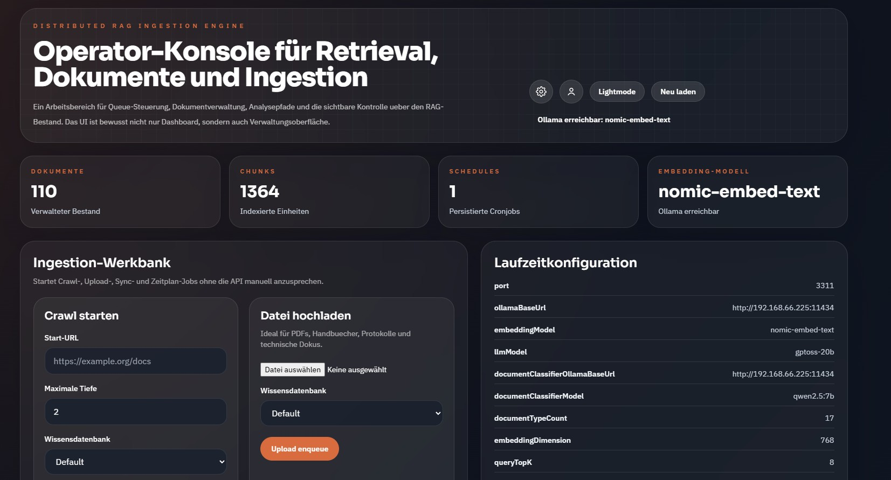
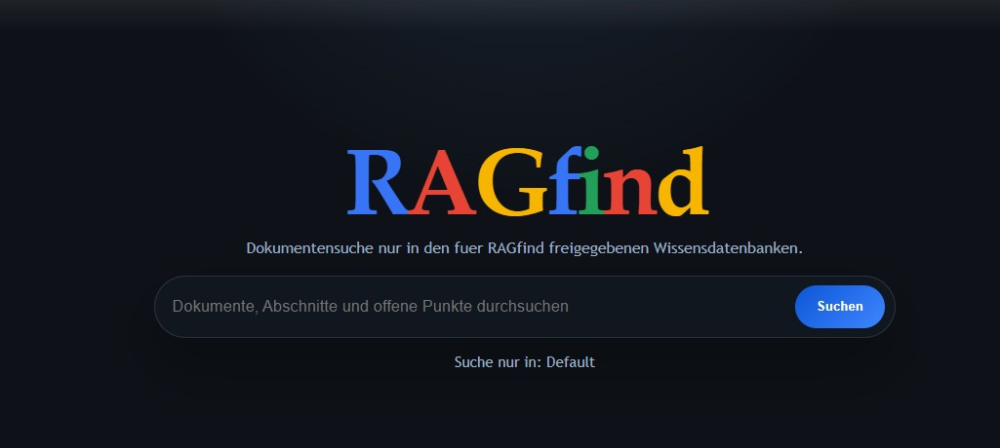
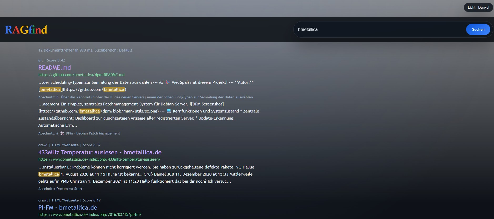

# RAG und RAGfind

Dokumentzentrierte RAG-Plattform mit Ingestion, hybrider Suche, MCP-Integration, Admin-Werkzeugen und einer separaten lokalen Suchoberfläche namens `RAGfind`.

Der Stack ingestiert Uploads, synchronisierte Verzeichnisse, gecrawlte Websites und Git-Repositories, extrahiert und strukturiert deren Inhalte, speichert Embeddings und Metadaten in PostgreSQL, stellt dokumentzentrierte APIs und MCP-Tools bereit und bietet zwei sichtbare Oberflächen:

- die Admin- und Betriebskonsole auf Port `3311`
- die Endnutzer-Suchoberfläche `RAGfind` auf Port `3312`

## Was Das Projekt Macht

Dieses Repository ist für Teams gedacht, die mehr brauchen als reine Vektorsuche.

Es kombiniert:

- Ingestion für Uploads, lokale Verzeichnisse, Websites und Git-Repositories
- OCR-Fallback für gescannte oder schwer extrahierbare Dokumente
- hybride Suche über Vektor-, Keyword-, Fuzzy- und dokumentzentrierte Reranking-Signale
- persistierte Dokumentstruktur mit Sections und Chunk-zu-Section-Zuordnung
- Analyse-Workflows für Aufgaben, Entscheidungen, Fristen, Risiken, Anforderungen, Setup-Schritte, Config-Keys, API-Surfaces und Zusammenfassungen
- MCP-Zugriff über HTTP und stdio für Open WebUI und andere MCP-fähige Clients
- wissensdatenbankbewusste Admin-Steuerung und principalbasierte Zugriffsskopierung
- `RAGfind` als separate Suchoberfläche mit lokalem Multisource-Viewer für HTML, Markdown, Code und Plaintext

## Aktuelle Laufzeitoberflächen

### Admin / API / MCP

- URL: `http://localhost:3311`
- stellt Operator-UI, Ingestion-Formulare, Dokumentbrowser, Admin-Einstellungen, Dokument-APIs und den MCP-Endpunkt bereit
- Basic Auth ist für Admin-Oberfläche und Admin-APIs aktiv
- Standard-Login ist `admin` / `admin`, bis es im UI geändert wird

### RAGfind

- URL: `http://localhost:3312`
- separater Such-Container und eigene Frontend-Oberfläche
- der Such-Scope ist im Admin-UI auf Port `3311` konfigurierbar
- gesucht wird nur in den für `RAGfind` freigegebenen Wissensdatenbanken
- Suchergebnisse öffnen in einem lokalen Multisource-Viewer statt direkt auf externe Seiten zu springen

### MCP

- HTTP-Endpunkt: `http://localhost:3311/mcp`
- lokaler stdio-Einstieg: `npm run dev:mcp:stdio` oder `npm run start:mcp:stdio`

## Screenshots

### Admin-UI



### RAGfind





## Kernfunktionen

### Ingestion

- manuelle Uploads
- Import-Verzeichnis-Sync über gemounteten Ordner
- rekursives Website-Crawling mit Download-Unterstützung für Dateien
- Git-Repository-Sync mit optionalem Branch- und Subpfad-Scope
- Extraktion für PDF, DOCX, ODT, TXT, Markdown, HTML, JSON, YAML, SQL, JS, TS, Python, Shell-Skripte und andere Text-/Code-Formate
- OCR-Fallback mit Tesseract und Ghostscript, wenn direkte Extraktion nicht ausreicht
- SHA-256-Deduplizierung vor Chunk- und Vektorpersistenz

### Retrieval

- semantische Vektorsuche in PostgreSQL plus pgvector
- PostgreSQL-Fulltext-Suche
- Fuzzy-Matching über Trigram-Indexe
- Exact-Match-Booster für Titel, Source-Ref und Inhalt
- dokumentzentriertes Reranking und Dokumentfokus-Verfeinerung
- Small-to-Big-Kontexterweiterung um starke Treffer herum
- Inventarmodus für Anfragen wie "welche Dokumente gibt es"
- Suchverbesserungen für Repo- und Entity-lastige MCP- und Open-WebUI-Abfragen

### Dokumentzentrierter Zugriff

- Volltextabruf kompletter Dokumente
- persistierte Sections und Strukturnavigation
- Originaldatei-Metadaten und stabile Download-URLs
- Dokumentvergleich und Versionsvergleich
- Cross-Reference-Abfragen über mehrere Dokumente hinweg
- lokaler Viewer für gecrawlte Websites, Markdown, Code-Dateien und Plaintext

### Analyse

- Extraktion von Meeting-Aufgaben
- Entscheidungsextraktion
- Fristenextraktion
- Anforderungsextraktion
- Extraktion von Config-Keys
- Extraktion von Setup-Schritten
- Extraktion von API-Surfaces
- Extraktion operativer Hinweise
- Risikoextraktion
- Entitätenextraktion
- Dokument- und Section-Zusammenfassungen

### Admin- und Multi-KB-Steuerung

- Knowledge-Base-CRUD im Admin-UI
- MCP-Principal-Verwaltung mit KB-Scope
- Admin-User-Verwaltung und Passwortwechsel-Flow
- editierbare Dokumenttyp-Einstellungen für Heuristik, Klassifikation und Smart Search
- konfigurierbarer Knowledge-Base-Scope für `RAGfind`

## Architektur

Zentrale Laufzeitkomponenten:

- `ingestor-app`: Express-API, Admin-Dashboard, Dokument-APIs, MCP über HTTP
- `ingestor-worker`: BullMQ-Worker für Hintergrund-Ingestion und Sync-Jobs
- `ragfind`: separater Express-Runtime für die `RAGfind`-Suche und den lokalen Viewer
- `rag-db`: PostgreSQL mit pgvector
- `redis`: BullMQ-Backend
- `elasticsearch`: optionale Hybrid-Suchsignalquelle
- externer Ollama-Endpunkt: Embeddings, Zusammenfassungen und Dokumentklassifikation

Primärer Ingestion-Flow:

1. Text aus Uploads, Syncs, Crawls oder Git-Inhalten extrahieren
2. bei unzureichender Extraktion auf OCR zurückfallen
3. Inhalte normalisieren und in Chunks zerlegen
4. Embeddings über Ollama erzeugen
5. Dokumente, Chunks, Sections, Originaldatei-Metadaten und Analyse-Artefakte in PostgreSQL persistieren
6. Retrieval über HTTP, Admin-UI, MCP und `RAGfind` bereitstellen

## Repository-Struktur

```text
src/
  config/          Environment-Handling
  db/              Pool, Migrationen, Startup-Migrationslauf
  mcp/             MCP-HTTP- und stdio-Einstiege
  ragfind/         separater RAGfind-Server-Einstieg
  routes/          HTTP-Endpunkte und gemeinsame Retrieval-Logik
  services/        Ingestion, Retrieval, OCR, Analyse, Sync, Crawl, Auth
  utils/           Chunking, Dateien, Hashing, Logging
  workers/         BullMQ-Worker-Runtime
migrations/        PostgreSQL-Schema- und Index-Migrationen
public/            Admin-/Operator-Frontend
public/ragfind/    RAGfind-Frontend
import-dir/        gemountetes Import-Verzeichnis für Sync-basierte Ingestion
scripts/           Hilfsskripte für Deployment-Workflows
```

## Anforderungen

- Node.js `20.11+`
- PostgreSQL mit pgvector
- Redis
- externer Ollama-Endpunkt
- Docker und Docker Compose für den einfachsten lokalen Betrieb
- optionale OCR-Abhängigkeiten für gescannte Inhalte

## Schnellstart Mit Docker Compose

1. Environment-Vorlage kopieren.

```bash
cp .env.example .env
```

2. Mindestens diese Werte anpassen:

- `OLLAMA_BASE_URL`
- optional `DOCUMENT_CLASSIFIER_OLLAMA_BASE_URL`
- optional `PUBLIC_BASE_URL`

3. Gesamten Stack bauen und starten.

```bash
docker compose up --build
```

4. Admin-Konsole unter `http://localhost:3311` öffnen.

5. `RAGfind` unter `http://localhost:3312` öffnen.

Der Standard-Compose-Stack startet:

- Admin/API/MCP auf `3311`
- `RAGfind` auf `3312`
- PostgreSQL auf Host-Port `5433`
- Redis auf Host-Port `6379`
- Elasticsearch auf Host-Port `9200`

## Lokale Entwicklung

1. Abhängigkeiten installieren.

```bash
npm install
```

2. Environment-Datei kopieren und anpassen.

```bash
cp .env.example .env
```

3. PostgreSQL, Redis, optional Elasticsearch und den Ollama-Endpunkt starten.

4. Migrationen ausführen.

```bash
npm run migrate
```

5. API, Worker und optional `RAGfind` in getrennten Terminals starten.

```bash
npm run dev
```

```bash
npm run dev:worker
```

```bash
npm run dev:ragfind
```

## Verfügbare Skripte

```bash
npm run dev              # API im Watch-Modus starten
npm run dev:worker       # BullMQ-Worker im Watch-Modus starten
npm run dev:ragfind      # RAGfind-Server im Watch-Modus starten
npm run dev:mcp:stdio    # MCP-Server über stdio im Watch-Modus starten
npm run build            # TypeScript kompilieren
npm run start            # kompilierte API starten
npm run start:worker     # kompilierten Worker starten
npm run start:ragfind    # kompilierten RAGfind-Server starten
npm run start:mcp:stdio  # kompilierten MCP-stdio-Server starten
npm run migrate          # SQL-Migrationen ausführen
```

## Wichtige Environment-Variablen

Kernservices:

- `PORT`: Admin/API-Port, Standard `3311`
- `DATABASE_URL`: PostgreSQL-Connection-String
- `REDIS_URL`: Redis-Connection-String
- `PUBLIC_BASE_URL`: Basis für erzeugte Download-Links und externe Referenzen

LLM und Embeddings:

- `OLLAMA_BASE_URL`
- `EMBEDDING_MODEL`
- `LLM_MODEL`
- `DOCUMENT_CLASSIFIER_OLLAMA_BASE_URL`
- `DOCUMENT_CLASSIFIER_MODEL`
- `EMBEDDING_DIMENSION`

Speicherung und Ingestion:

- `IMPORT_DIR`
- `UPLOAD_DIR`
- `ORIGINAL_STORAGE_DIR`
- `GIT_REPO_CACHE_DIR`
- `GIT_REPO_MAX_FILE_BYTES`
- `CRAWL_DEFAULT_MAX_DEPTH`

Retrieval-Tuning:

- `QUERY_TOP_K`
- `QUERY_CANDIDATE_K`
- `QUERY_MAX_CHUNKS_PER_DOCUMENT`
- `QUERY_VECTOR_WEIGHT`
- `QUERY_KEYWORD_WEIGHT`
- `QUERY_EXACT_MATCH_BOOST`
- `QUERY_RERANK_TOP_N`
- `QUERY_SMALL_TO_BIG_WINDOW`

Suchschicht-Integration:

- `ELASTICSEARCH_URL`
- `ELASTICSEARCH_INDEX_PREFIX`

Die aktuellen Defaults stehen in `.env.example`.

## Dashboard und Admin-UI

Die Admin-Konsole auf Port `3311` enthält aktuell:

- Upload-, Crawl-, Directory-Sync- und Git-Import-Formulare
- Dokumentbrowser mit Vorschau und Dokumentaktionen
- Trigger-Oberflächen für Dokumentanalysen
- Unterstützung für Dokument-Reklassifikation
- Knowledge-Base-Verwaltung
- MCP-Principal-Verwaltung
- Admin-User-Verwaltung
- Dokumenttyp-Einstellungen
- `RAGfind`-KB-Auswahl

Die Admin-Konsole ist die Stelle, an der der Such-Scope für `RAGfind` konfiguriert wird.

## RAGfind

`RAGfind` ist ein separater Container und ein separates Frontend für die Endnutzer-Dokumentsuche.

Aktuelles Verhalten:

- sucht nur in den für `RAGfind` aktivierten Wissensdatenbanken
- gruppiert Chunk-Treffer zu dokumentzentrierten Ergebnissen
- zieht bei Bedarf direkte Titel- und Source-Ref-Treffer als Ergänzung nach
- öffnet immer einen lokalen Viewer statt gecrawlte Seiten direkt auf der Live-Website aufzurufen
- bietet einen Multisource-Viewer mit gerendertem HTML, gerendertem Markdown, syntaxhervorgehobenem Code und einem Plaintext-Tab

## Open-WebUI-Integration

Open WebUI sollte nur über MCP angebunden werden.

Empfohlener Endpunkt:

```text
http://localhost:3311/mcp
```

Es gibt in diesem Repository keine mitverwalteten Open-WebUI-Python-Filter-, Tool- oder Action-Dateien mehr.

## MCP-Unterstützung

Der Service stellt MCP in zwei Modi bereit.

### Streamable HTTP MCP

Endpunkt:

```text
http://localhost:3311/mcp
```

### Lokales stdio-MCP

Entwicklung:

```bash
npm run dev:mcp:stdio
```

Produktions-Build:

```bash
npm run build
npm run start:mcp:stdio
```

### MCP-Tool-Kategorien

Verfügbare Tools decken ab:

- Retrieval und Smart Search
- Dokumentlisten und Dokument-Lookups
- Volltext-, Section- und Strukturzugriff
- Originaldatei-Metadaten
- Dokumentanalysen und Zusammenfassungen
- Dokumentvergleiche und Cross-Reference-Workflows

## Wichtige HTTP-API-Endpunkte

### Retrieval

- `POST /api/smart-search`
- `POST /api/cross-reference`

### Dokumente

- `GET /api/documents`
- `GET /api/documents/:id`
- `GET /api/documents/:id/fulltext`
- `GET /api/documents/:id/sections`
- `GET /api/documents/:id/structure`
- `GET /api/documents/:id/section`
- `GET /api/documents/:id/original/meta`
- `GET /api/documents/:id/original`

### Analyse

- `GET /api/documents/:id/analysis/actions`
- `GET /api/documents/:id/analysis/decisions`
- `GET /api/documents/:id/analysis/deadlines`
- `GET /api/documents/:id/analysis/requirements`
- `GET /api/documents/:id/analysis/config-keys`
- `GET /api/documents/:id/analysis/setup-steps`
- `GET /api/documents/:id/analysis/api-surface`
- `GET /api/documents/:id/analysis/operational-notes`
- `GET /api/documents/:id/analysis/risks`
- `GET /api/documents/:id/analysis/entities`
- `GET /api/documents/:id/summary`
- `GET /api/documents/:id/section-summary`
- `GET /api/documents/:id/compare`
- `GET /api/documents/:id/compare-version`

## Hinweise Zu Crawl und Git

- Website-Crawling folgt same-site Links und herunterladbaren Dateien
- weitergeleitete Domains wie `bmetallica.de -> www.bmetallica.de` werden über den Redirect-Ursprung hinweg korrekt gecrawlt
- Git-Ingestion unterstützt optionalen Branch- und Subpfad-Scope und indexiert gängige Text- und Code-Formate

## GitHub-Repository-Vorbereitung

Dieses Repository ist für die Veröffentlichung auf GitHub vorbereitet mit:

- einer repositorytauglichen README
- einer MIT-Lizenz
- `.gitignore` für Node, Build, lokale Envs und Import-Artefakte
- Anleitungen für containerbasierten und lokalen Betrieb
- einer klaren Trennung zwischen Admin-Oberfläche und `RAGfind`

## Lizenz

Dieses Projekt steht unter der MIT-Lizenz. Siehe `LICENSE`.

## Roadmap und Design-Notizen

Für tiefere Produkt- und Retrieval-Notizen siehe:

- `ROADMAP.md`
- `rag-logik.md`

## Status

Das Repository ist weiterhin in aktiver Entwicklung, die aktuelle Implementierung enthält aber bereits:

- Multi-Source-Ingestion
- persistierte Struktur- und Originaldatei-Referenzen
- Analyse- und Summary-Workflows
- MCP-Integration
- wissensdatenbankbewusste Admin-Konfiguration
- separate `RAGfind`-Sucherfahrung mit lokalem Viewer
